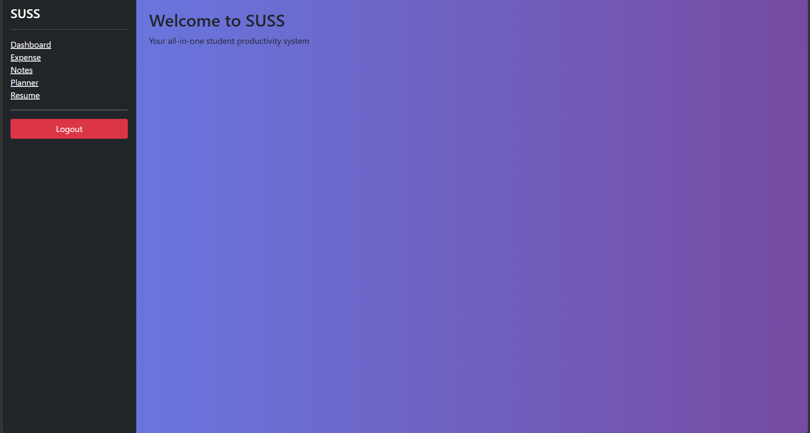
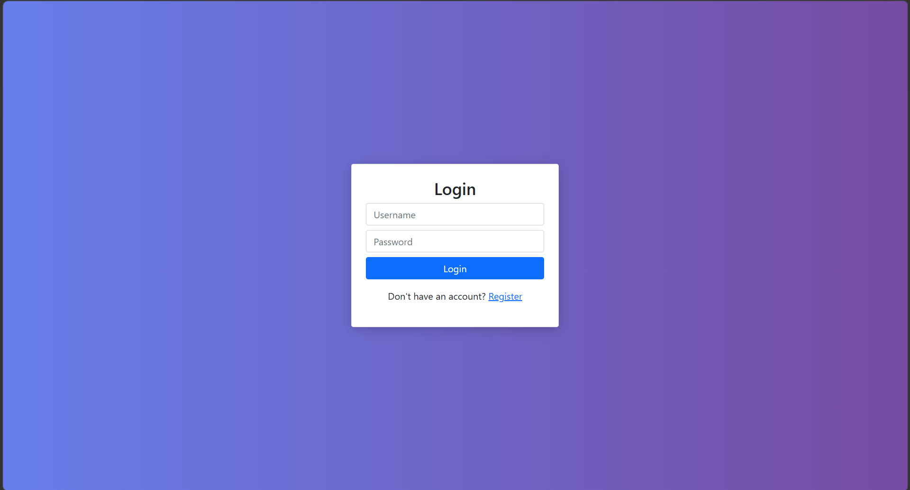
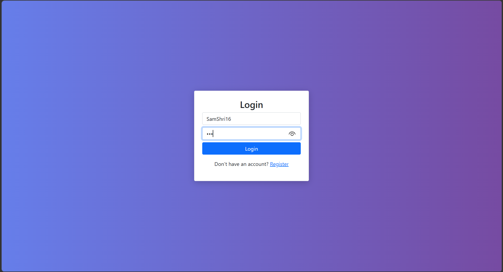
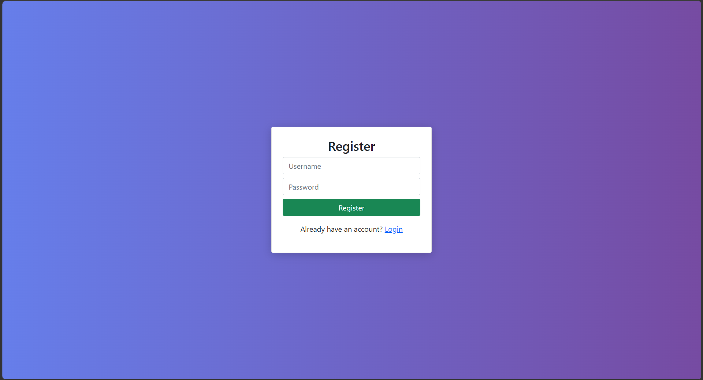
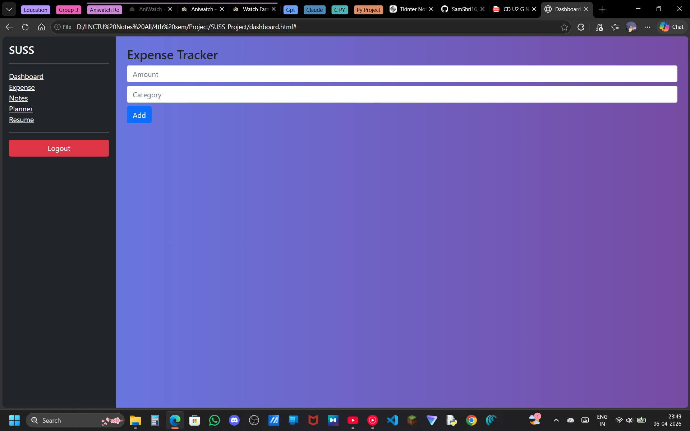
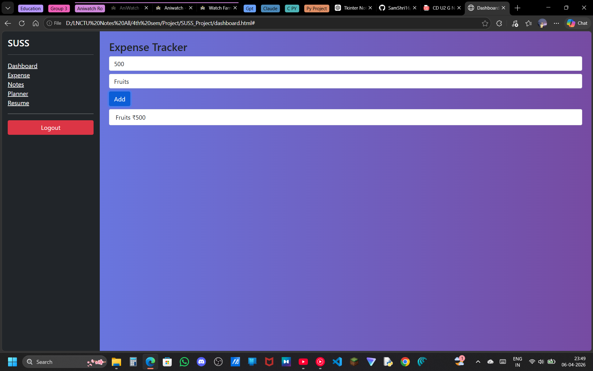
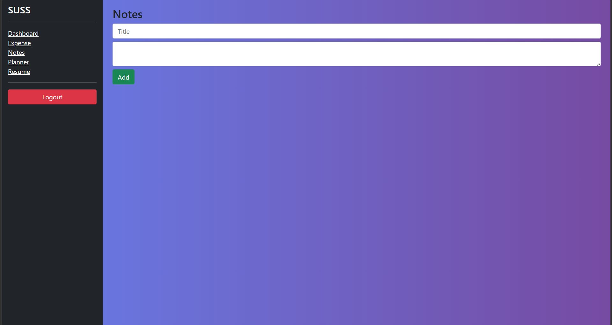
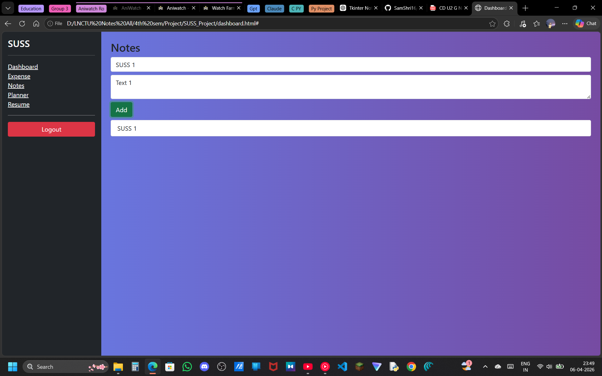
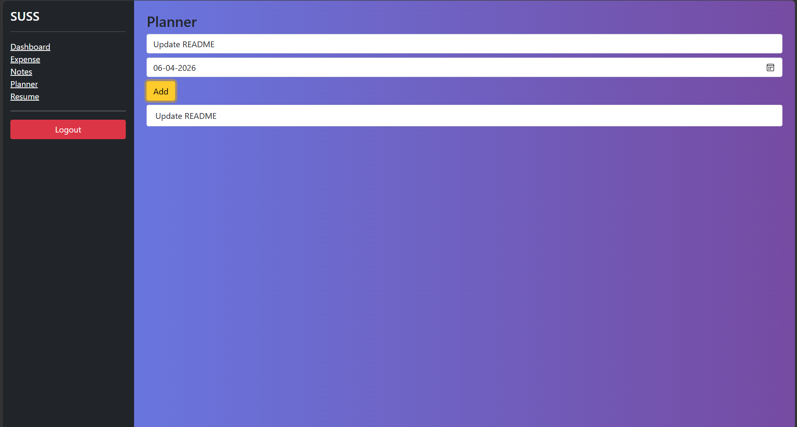

# 🎓 SUSS – Student Utility Student System

An all-in-one student productivity web application designed to manage academic and personal tasks efficiently.

---

## 🚀 Features
💸 Expense Tracker – Track and manage daily expenses
📝 Notes Management – Store and organize notes
📅 Study Planner – Plan tasks and deadlines
📄 Resume Skill Matcher – Match skills with job requirements
🔐 User Authentication – Secure Login & Registration
📌 Dashboard UI – Sidebar-based integrated system

---

## 🖼️ Screenshots

### 🏠 Dashboard

 

### 👋 Login Page

 

### 📝 Register Page

 

### 📊 Features/Modules Pages

 

---

## 🛠️ Tech Stack
Frontend: HTML, CSS, Bootstrap
Backend: Django (Python)
Database: SQLite
Version Control: Git & GitHub
---

## ⚙️ Installation & Setup
1️⃣ Clone the Repository

git clone https://github.com/SamShri16/SUSS_Project.git

cd SUSS_Project

2️⃣ Create Virtual Environment

python -m venv venv
venv\Scripts\activate

3️⃣ Install Dependencies

pip install django

4️⃣ Apply Migrations

python manage.py makemigrations
python manage.py migrate

5️⃣ Run the Server

python manage.py runserver

Open in browser:
http://127.0.0.1:8000

---

## 🎯 Project Objective

Many students struggle to manage different productivity tools separately.
This project provides a unified platform that integrates essential utilities like expense tracking, notes, planning, and resume analysis into a single system.

---

## 📚 Learning Outcome

* Learned to design structured web applications
* Implemented authentication UI flow
* Built a clean and consistent UI
* Built a full-stack web application using Django
* Implemented authentication system (login/register/logout)
* Designed a clean and structured dashboard UI
* Integrated multiple modules into one system
* Gained experience in backend + frontend integration
* Improved frontend development skills

---

## 👨‍💻 Contributors
Samarth Shrivastava
Raunak Shukla
---

⭐ If you like this project, consider giving it a star!
